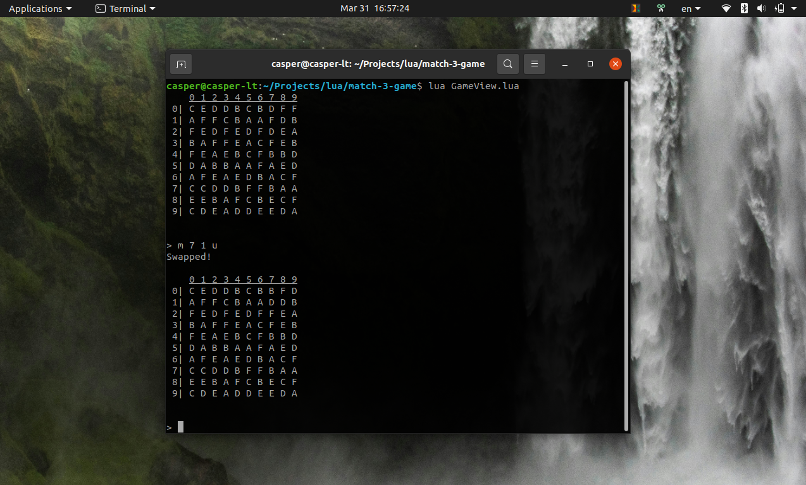

> [!NOTE]
> Автор данного кода прежде не был знаком и никогда не использовал язык lua

## Запуск
```
lua GameView.lua 
```

## Пример вывода


## Некоторые замечания
### Функция mix()
В качестве алгоритма используется [Тасование Фишера-Йетса](https://ru.wikipedia.org/wiki/%D0%A2%D0%B0%D1%81%D0%BE%D0%B2%D0%B0%D0%BD%D0%B8%D0%B5_%D0%A4%D0%B8%D1%88%D0%B5%D1%80%D0%B0_%E2%80%94_%D0%99%D0%B5%D1%82%D1%81%D0%B0). 

Функция срабатывает автоматически в случае отсутствия возможных комбинаций на игровом поле, но стоит отметить, что возможна ситуация в которой никакое количество перемешек не создаст доступных комбинаций. 

 Данная реализация просто производит генерацию нового игрового поля в подобных ситуациях:
```lua
function GameModel:mix()
    Shuffle2DArray = require("Shuffelling")
    local boxtimer = 0

    repeat
        boxtimer = boxtimer + 1
        self.gameField = Shuffle2DArray(self.gameField)
    until not hasFieldCompleteCombinations(self.gameField) and isFieldSwappable(self.gameField)
          or boxtimer > 200

    if boxtimer < 200 then
        print("No available combinations. Game field has mixed.\n") 
    else
        self.gameField = generateField(gameFieldSize)
        print("Game Field couldn't be mixed with available combinations and has regenerated.\n")
    end
end
```

Возможно вызвать mix вручную, прописав в терминале:
```
mix
```

Проверить, что значения действительно перемешались и не произошло подмен в массиве размером 10х10 может быть муторно, поэтому на время тестирования возможно уменьшить его размер до 3х3. Для этого нужно изменить значение `gameFieldSize` в файле `GameModel.lua` на 3:
```lua
13  ...
14  local gameFieldSize = 3
15  ...
```

### О возможности добавления разных видов  комбинаций и камней
Стандартные комбинации для игр типа 3 в ряд обычно включают горизонтальные/вертикальные молнии и их комбинацию. Чтобы выявить направления, по которым произошли совпадения, они разделяются по группам:
```lua
local function cleanMatchedCells(coords, field)
    local directions = { { 1, 0 }, { 0, 1 } } -- horizontal, vertical
    local coordsForCleaning = {}

    -- Search match of the cells and split them to horizontal or vertical group
    for _, coord in ipairs(coords) do
        local x, y = coord[1], coord[2]
        local groups = {
            { name = "hor_group",  data = {} },
            { name = "vert_group", data = {} }
        }

        for i = 1, #directions do
            local dx, dy = directions[i][1], directions[i][2]
            local group = groups[i].data
            local sideChecked = 0

            while sideChecked < 2 do
                if isWithinBounds(field, x + dx, y + dy) and field[y][x] == field[y + dy][x + dx] then
                    table.insert(group, { x + dx, y + dy })
                    dx = (dx > 0 and dx + 1) or (dx < 0 and dx - 1) or dx
                    dy = (dy > 0 and dy + 1) or (dy < 0 and dy - 1) or dy
                else
                    sideChecked = sideChecked + 1
                    dx, dy = directions[i][1] * -1, directions[i][2] * -1
                end
            end
        end

        -- Save matched cells coordinates to clean them later
        for _, group in ipairs(groups) do
            if #group.data >= 2 then
                for _, subgroup in ipairs(group.data) do
                    table.insert(coordsForCleaning, subgroup)
                end
                table.insert(coordsForCleaning, { x, y })
            end
        end
    end
```

В данном блоке кода возможно изменение алгоритма очистки ячеек при тех или иных условиях (например, при наличии 5 и более одинаковых камней по одному направлению, будет производиться замена типа текущего камня вместо его уничтожения). Для определения типа камня также потребуется создать и заполнить ячейки объектами типа Cell, вместо обычных символов. Пример "класса" ячейки:
```lua
local CellModel = {}
CellModel.__index = CellModel

function CellModel:new(color, type)
    self.color = color
    self.type = type -- Common / Horizontal_lighting / ...
    return self
end
```


